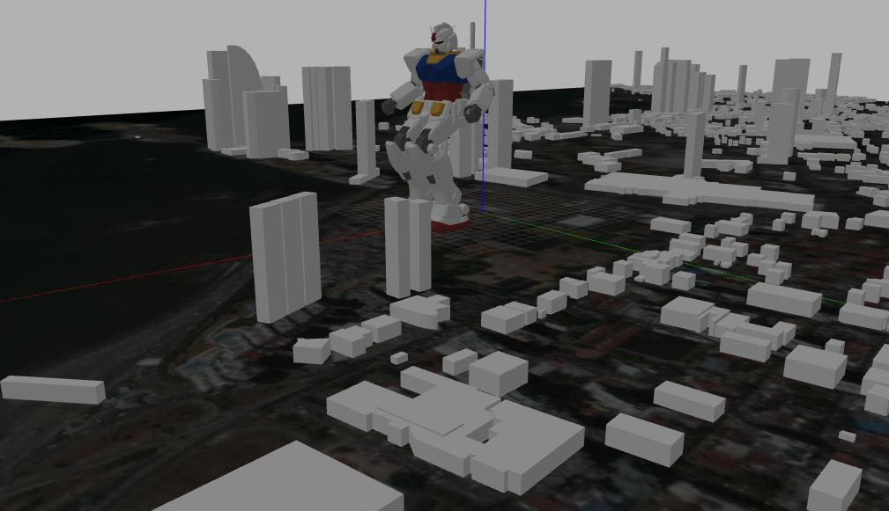
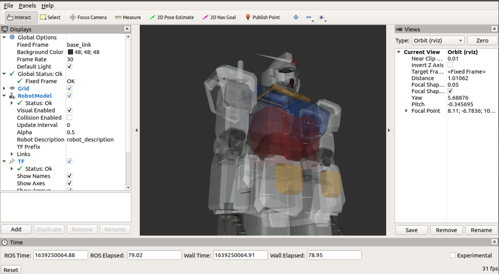

gundam_robot_Panama
========================================================================================================================================================================
ROS packages for GUNDAM robots

original: https://github.com/gundam-global-challenge/gundam_robot.git





How to setup workspace
----------------------

```
$ mkdir -p catkin_ws/src
$ cd  catkin_ws
$ cd src/
$ git clone https://github.com/GenteBuena/gundam_robot_panama.git
$ cd ..
$ source /opt/ros/$ROS_DISTRO/setup.bash
$ rosdep install -y -r --from-paths src --ignore-src
$ catkin_make
$ source devel/setup.bash
```

How to visualize URDF model
===========================

To visualize URDF file in your rviz, you can use `display.launch` file.
```
$ roslaunch gundam_rx78_description display.launch
```




How to run gazebo simulation
============================

To run a gazebo dynamics simulation, you can start `gundam_rx78_world.launch`.

```
$ roslaunch gundam_rx78_gazebo gundam_rx78_world.launch
```

To control joint angles, try a sample script.

```
# move upper body
$ rosrun gundam_rx78_control joint_trajectory_client_example.py
```

Experimental
------------

You can run "Robot"-like walking pattern on simulation

```
$ roslaunch gundam_rx78_gazebo gundam_rx78_walk.launch
```

```
# step
$ rosrun gundam_rx78_control joint_trajectory_client_csv.py `rospack find gundam_rx78_control`/sample/csv/step.csv
# walk forward
$ rosrun gundam_rx78_control joint_trajectory_client_csv.py `rospack find gundam_rx78_control`/sample/csv/walk-forward.csv
# walk backward
$ rosrun gundam_rx78_control joint_trajectory_client_csv.py `rospack find gundam_rx78_control`/sample/csv/walk-backward.csv
# walk to right
$ rosrun gundam_rx78_control joint_trajectory_client_csv.py `rospack find gundam_rx78_control`/sample/csv/walk-to-right.csv
# walk to left
$ rosrun gundam_rx78_control joint_trajectory_client_csv.py `rospack find gundam_rx78_control`/sample/csv/walk-to-left.csv
# turn right
$ rosrun gundam_rx78_control joint_trajectory_client_csv.py `rospack find gundam_rx78_control`/sample/csv/turn-right.csv
# turn left
$ rosrun gundam_rx78_control joint_trajectory_client_csv.py `rospack find gundam_rx78_control`/sample/csv/turn-left.csv
```

```
# raise Arms and walk
$ rosrun gundam_rx78_control joint_trajectory_client_csv.py `rospack find gundam_rx78_control`/sample/csv/up.csv
```


Note that currently, we have several limitation on this simulation, we only have position controller etc.

You can also find sample motion control files in the `gundam_rx78_control/sample` directory.

joint_trajectory_client_csv.py
----------------------

using the gundam control with joint_tajectory_client_csv.py and inputting a .csv file 

This will use the patterns indicated in the file to simulate the movement of the gundam according to the values of the angles of each component.


